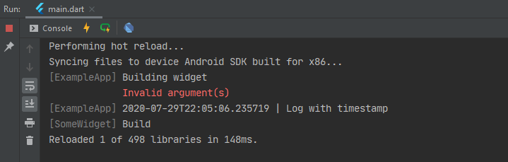

# LogX: Simple and concise logs for Flutter


LogX adds extends method `log` from `dart:developer` package to add useful features, namely mixins and static methods.



## Mixin

You can use `LogMixin` to easily include log methods into any class. With mixin name of the context is automatically set to runtime type of current class.

```dart
class A with LogMixin {
    void hello() {
        log.d('Hello world!');
        log('This instance is callable!');
    }
}
```

You can either use methods: `log.d('Hello')` or call the class instance: `log('Hello')`. Both results to equal output.

## Static methods

If you cannot use `LogMixin` (for example in top-level functions) you can use static methods from  `Log` class. Remeber that you need to provide name by yourself, otherwise default name is used.

```dart
void main() {
    Log.d('Hello', name: 'Main');
}
```

***

**Important:** Do not import `dart:developer` together with this package. They both use `log` keyword and it might conflict.